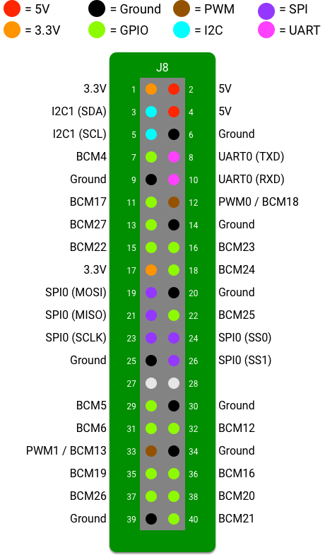
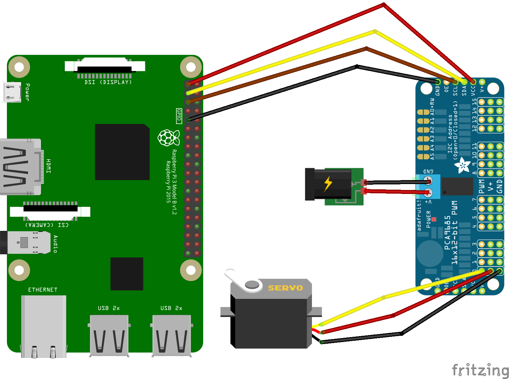

# ECE110HL Lab Development Guide

## 3D Modeling Design

## Hardware Connection
树莓派4b / PCA9685控制板(servo driver) / 杜邦线 / 控制舵机

### 控制舵机

通常情况下，舵机是由一个标准的直流系统和一个内部反馈控制装置（一个减速齿轮和电位计）来组成的。舵机的主要作用是将齿轮轴旋转到一个预定义的方向上。伺服电机（舵机）有3个输入引脚，GND、VCC和Signal。脉冲宽度调制技术（PWM）被应用于舵机的控制，轴的方向由脉冲的持续时间决定。需要记住的是，舵机转动的方向不是由占空比决定的，而是由脉冲长度 t 决定的。有的舵机使用的PWM频率为 fPWM=50HZ，其对应于的PWM周期 T=20 ms。脉冲长度 t 和转动方向之间的关系是线性的，但也取决于电机和齿轮的配合。（具体的原理可以参考这篇博客：https://cloud.tencent.com/developer/article/1602882）

### 用PCA9685控制多个舵机

通过软件生成稳定的PWM信号对于运行Linux的树莓派来说是一个很大的挑战，在系统上运行的其他进程可能会随时中断PWM信号的生成。用了同时控制多个舵机，我们需要使用一个额外的电机驱动版（安装有PCA9685芯片）。NXP的PCA9685芯片采用I2C接口可同时产生16个PWM信号。

### 树莓派4GPIO接口介绍
GPIO (General Purpose Input Output)即通用输入输出，可以简称“IO口”。你可以理解为元器件上的一个引脚，它具有很多的功能。这里说几个树莓派上我们会用到的功能

#### 用作I2C接口
I2C是智能硬件电路上最常用的数据传输总线，只需要2根线，就能够挂载多个从设备，能够双向传输，最大速度可达400Kbps，非常适合传输控制指令和小量数据。平时大家用的G-sensor传感器、光距离传感器、电容触摸屏、LED灯控制器、摄像头的控制命令等，几乎都是I2C接口的。GPIO口用作I2C，算是GPIO传数据的最常用的方式。如果芯片内部自带I2C控制器，可以直接配置GPIO切换到硬件I2C上。例如单片机几乎都可以这么做。

#### PWM输出
ECE110课讲的差不多了

接下来就返回来说一下树莓派的GPIO接口

PCA9685芯片工作电压在2.3 - 5.5V，可以由树莓派的3V输出供电，舵机供电使用外部电源，如果使用树莓派的5V输出可能引起树莓派的不稳定。树莓派、PCA9685和舵机的接线图如下

树莓派3.3V输出连接PCA9685的VCC
树莓派GND连接PCA9685的GND
树莓派SCL连接PCA9685的SCL
树莓派SDA连接PCA9685的SDA
舵机的黄线连接channel 0的PWM
舵机的红线连接channel 0的V+
舵机的棕线连接channel 0的GND

